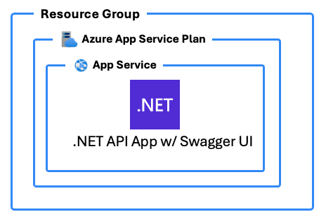

# azd-csharp-api-swagger 

An Azure Developer CLI (`azd`) template to deploy a C# API with Swagger UI to Azure App Service

This app contains a really simple TODOs API just as an example to get you started using this as a template for a new project.

## Prerequisites

To deploy this template you will need to have the following installed:

- Azure Developer CLI
- .NET 9+

## Deployment

To use this template, follow these steps using the [Azure Developer CLI](https://learn.microsoft.com/azure/developer/azure-developer-cli/overview):

1. Log in to Azure Developer CLI. This is only required once per-install.

    ```bash
    azd auth login
    ```

2. Initialize this template using `azd init`:

    ```bash
    azd init --template build5nines/azd-csharp-api-swagger
    ```

3. Use `azd up` to provision your Azure infrastructure and deploy the web application to Azure.

    ```bash
    azd up
    ```

4. Once provisioning and deployment has completed, navigate your browser to the **Application URL**, and you will see the Swagger UI for the API App.

## Architecture Diagram



## Azure Resources

These are the Azure resources that are deployed with this template:

- **App Service Plan** - The environment for hosting the App Service web app.
- **App Service** - The App Service web app to deploy and run the .NET API app.

## Author

This `azd` template was written by [Chris Pietschmann](https://pietschsoft.com), founder of [Build5Nines](https://build5nines.com), Microsoft MVP, HashiCorp Ambassador, and Microsoft Certified Trainer (MCT).
